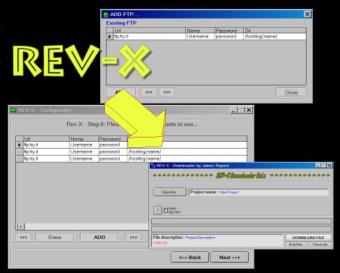



## REV\-X BETA DOWNLOADER

### Description

REV-X BETA DOWNLOADER! This software was mainly created for warez purpose. You can use the configurator (like Bobdown) and split your warez file into hundreds of little files, then configure your free accounts (like digiland, lycos, ecc.ecc...). The software automatically upload and rename all the files creating a fake ftp structure (Like images...website...). Then you can create a little file named.RVX. Now you can (and the final user) open with the Downloader included this little file and use it to automatically download the files and replitting it to recreate the original file! And the account don't delete the files because they seems part of a website!! It's complex to explain but easy to do! TRY IT!! It's made by me, if you like it vote for me or send feedback! For any explanation please e-mail me.

YOU NEED ALSO REV-X BETA CONFIGURATOR. SEARCH AND DOWNLOAD IT IN PSC.
 
### More Info
 

             |
---                |---
**Submitted On**   |2002-08-29 16:44:40
**By**             |[James Raynor](https://github.com/Planet-Source-Code/PSCIndex/blob/master/ByAuthor/james-raynor.md)
**Level**          |Intermediate
**User Rating**    |3.0 (18 globes from 6 users)
**Compatibility**  |VB 6\.0
**Category**       |[Complete Applications](https://github.com/Planet-Source-Code/PSCIndex/blob/master/ByCategory/complete-applications__1-27.md)
**World**          |[Visual Basic](https://github.com/Planet-Source-Code/PSCIndex/blob/master/ByWorld/visual-basic.md)
**Archive File**   |[REV\-X\_BETA14638010152002\.zip](https://github.com/Planet-Source-Code/james-raynor-rev-x-beta-downloader__1-39857/archive/master.zip)

